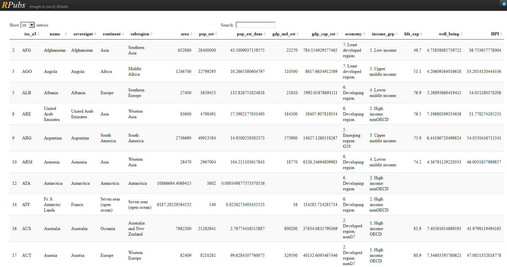

```{r setup, include=FALSE}
knitr::opts_chunk$set(echo = T,warning=F)
```

## Preliminaries

- Usually I have big differences in knowledge and abilities of the participants - please tell, if it is too fast or slow.
- I have lots of hands-on coding [**exercises**](http://web.math.ku.dk/~helle/R-intro/exercises.pdf) - later you can only learn on your own
- We have many [**examples**](https://www.showmeshiny.com/) - try them
- If there are questions - always ask
- R is more fun together  - strong proponent of
collaborative work!


## Adjustments for online course

- Quick 
- One slide - one example - 
- Easy to use


## Getting help on packages

```{r,eval=F}
# provides details regarding contents of a package
help(package = "osmplotr")
# list vignettes available for a specific package
vignette(package="osmplotr")
# view specific vignette
vignette("data-maps")
```


## The `World` dataset

### Natural Earth

- Dataset contains information from [**Natural Earth**](http://www.naturalearthdata.com/)

```{r}
data(World)
```


## The `qtm` command from the `tmap` package

### Fast thematic map

- With [**qtm**](https://cran.r-project.org/web/packages/tmap/vignettes/tmap-nutshell.html) you can create a fast thematic map

- Example from the [**Vignette**](https://cran.r-project.org/web/packages/tmap/vignettes/tmap-nutshell.html) for the `tmap` package

```{r}
library(tmap)
data(World)
qtm(World)
```


## To get more color in the map

### Economic development status

<!--
<http://www.naturalearthdata.com/>
-->
```{r}
qtm(World, fill="economy")
```


## A map with text

### Population

```{r}
qtm(World, fill="pop_est", text="iso_a3")
```

## This Scheme is better:

### [**GDP**](https://en.wikipedia.org/wiki/Population_density)

```{r}
qtm(World, fill="gdp_cap_est", text="iso_a3", 
    text.size="AREA", root=5, fill.title="GDP per capita", 
    fill.textNA="Non-European countries", theme="Europe")
```


## Topics of the World dataset

### Available variables in the data set

- [**ISO classification**](http://userpage.chemie.fu-berlin.de/diverse/doc/ISO_3166.html)
- country name
- Area, population, population density, 
- [**Gross Domestic Product**](https://en.wikipedia.org/wiki/Gross_domestic_product)
- Gross domestic product [**at purchasing power parities**](https://en.wikipedia.org/wiki/List_of_countries_by_GDP_%28PPP%29_per_capita)
- Economy, income group


## The World Dataset - Variables and what's behind


```{r,echo=F}
library(XML)
info <- colnames(World)

info_df <- data.frame(World)
knitr::kable(info_df[1:8,1:5])
```


## The variable `continent`

```{r}
qtm(World, fill="continent")
```

<!--
## The variable `part`

```{r,eval=F}
qtm(World, fill="part",fill.title="Teil von Europa")
```
-->

## The variable `area`

```{r}
qtm(World, fill="area") # Russia is huge
```


## Population

```{r}
qtm(World, fill="pop_est",fill.title="Population") 
```


## Two maps

### Population and level of development

```{r,eval=T}
tm_shape(World) + tm_fill(c("pop_est", "economy"), 
        title=c("Population", "Economy"))
```


<!--
## A dataset about the provinces in the Netherlands (R-package `tmap`)

```{r,echo=F,eval=F}
data(NLD_prov)
NLD_df <- NLD_prov@data
NLD_df[,6] <- round(NLD_df[,6])

datatable(NLD_df[,1:6], class = 'cell-border stripe',rownames = FALSE,
          options = list(pageLength = 10, autoWidth = TRUE)
          )
```

```{r,echo=F,eval=F}
data(NLD_prov)
NLD_df <- NLD_prov

kable(head(NLD_df))
        
```

-->

## Netherlands - Population in the provinces

```{r,eval=F}
qtm(NLD_prov, fill="population",fill.title="population") 
```


```{r dataland,echo=F,eval=F}
data(land)
info_df <- land@data[1:100,]
datatable(info_df)
```

```{r}
data(land)
data(World)
```


```{r,echo=F,eval=F}
data(land)
info_df <- land[sample(1:length(land),10,replace=T),]
kable(info_df[,c(2,3)])
```

```{r,eval=F,echo=F}
?land
```


```{r}
tm_shape(land,  relative=FALSE) +
    tm_raster("trees", title="prop. wooded area")
```


## Visualize only one country

```{r}
tm_shape(World[World$name=="Austria", ]) +
    tm_polygons()
```


## Load example data

### Data source Eurostat

- Data about unemployment in Europe

```{r}
url <- "https://raw.githubusercontent.com/Japhilko/
GeoData/master/2015/data/Unemployment07a13.csv"

Unemp <- read.csv(url) 
```


## Excursus: the command `match`

### Create two example vectors

```{r}
vec_a <- c("A",2,6,1,"C")
vec_b <- c(1,"C",2)
```

### Bringing the two vectors together

- With the function `match` you can see which element of the first vector matches the second vector.

```{r}
match(vec_a,vec_b)
```


## Use the package `tmap` with your data

```{r,warning=F}
library("tmap")
```

### Match the data

```{r}
iso_a2<- substr(World$iso_a3,1,2)
ind <- match(iso_a2,Unemp$GEO)
World$Val2007M12 <- Unemp$Val2007M12[ind]
World$Val2013M01 <- Unemp$Val2013M01[ind]
```

## Plot a map

```{r}
qtm(World,c("Val2007M12","Val2013M01"))
```


## Exercise: Visualisation of Eurostat data

### First part - plot a map

- Download and import the data `unemprate_by_sex.csv` from ILIAS.
- Link the data with map data .
- Visualise the linked data in a map.

### If you have that:

- Search for example [**here**](https://ec.europa.eu/eurostat/web/euro-indicators) for datasets containing the country name and visualize the data with `tmap`.


## The World-Dataset


```{r,echo=F,eval=F}
# http://rstudio.github.io/DT/
datatable(World, class = 'cell-border stripe',rownames = FALSE,
          options = list(pageLength = 10, autoWidth = TRUE)
          )
# to see the options http://datatables.net/reference/option/
```

### [**The World Dataset in Package `tmap`**](http://rpubs.com/Japhilko82/tmap_europe_dataset)
<!--
```{r,echo=F,eval=F}
kable(Europe@data[1:10,1:4])
```
-->




## The package `tmaptools`

```{r}
library(tmaptools)
```


```{r}
citation("tmaptools")
```

## Geocoordinates

```{r}
(gc_z <- geocode_OSM("Zürich"))
```


## Necessary packages

```{r}
library(osmplotr)
library(tmap)
```


## Buildings within a bounding box

```{r,cache=T,eval=F}
bbox <- get_bbox (c(8.4539 , 49.4805  , 8.4774 , 49.4943 ))
dat_M <- extract_osm_objects (key = 'building', bbox = bbox)
```

```{r,eval=F,echo=F}
save(dat_M,file="data/osm_mannheim.Rdata")
```

```{r,echo=F}
load("data/osm_mannheim.Rdata")
```


```{r}
qtm(dat_M,fill=c("purple"),borders="black")
```

## Colour picker


## 30daymapchallenge