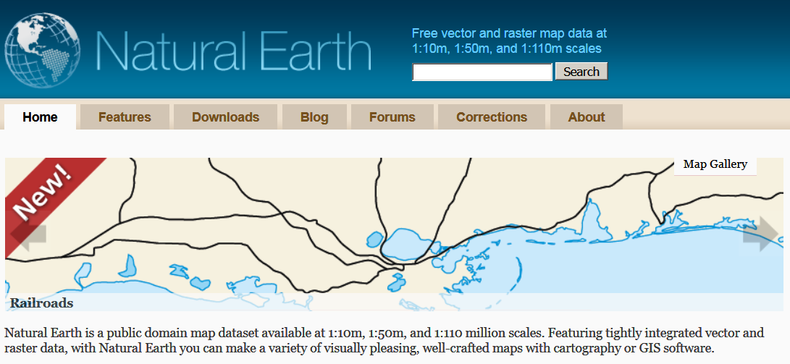

```{r setup, include=FALSE}
knitr::opts_chunk$set(echo = T,warning=F,message=F)
```


## Motivation


## About the tutorial


### Organisation

- Four sections with each 20 min presentation and 10 minutes testing time for you

### Sections

1. Focus on quick maps - some classics 

2. Basic data structures - Simple Features

<!--
the new way to work with geodata in R
-->

3. Openstreetmap 

4. OSM maps with R

<!--
30 day maps challenge
-->


## Hello World

### A classic - the `maps` package

- `maps` package by Richard A. Becker, Allan R. Wilks and Ray Brownrigg

```{r out.height = "80%"}
library(maps)
data(world.cities)
map()
map.cities(world.cities,col=rgb(0,0,1,.05),cex=2,
           pch=20)
```


## A second classic - `maptools` package

```{r}
library(maptools)
data("wrld_simpl")
plot(wrld_simpl,col="red")
```


## The `wrld_simpl` package

```{r,eval=F}
head(wrld_simpl@data)
```


## The `sp` package

### Classes and Methods for Spatial Data


```{r}
sp::spplot(wrld_simpl,"AREA")
```


## The `qtm` command from the `tmap` package

### Fast thematic map

- With [**qtm**](https://cran.r-project.org/web/packages/tmap/vignettes/tmap-nutshell.html) you can create a fast thematic map

- Example from the [**Vignette**](https://cran.r-project.org/web/packages/tmap/vignettes/tmap-nutshell.html) for the `tmap` package

```{r,eval=F}
library(tmap)
data(World)
qtm(World)
```

{width=50%}


## To get more color in the map

### Economic development status

<!--
<http://www.naturalearthdata.com/>
-->
```{r out.height = "80%"}
library(tmap)
data(World)
qtm(World, fill="economy")
```


## A map with text

### Population

```{r}
qtm(World, fill="pop_est", text="iso_a3")
```

## This Scheme is better:

### [**GDP per capita**](https://en.wikipedia.org/wiki/Population_density)

```{r}
qtm(World, fill="gdp_cap_est", text="iso_a3", 
    text.size="AREA")
```


## The variable `continent`

```{r}
qtm(World, fill="continent")
```

<!--
## The variable `part`

```{r,eval=F}
qtm(World, fill="part",fill.title="Teil von Europa")
```
-->

## The variable `area`

```{r}
qtm(World, fill="area") # Russia is huge
```


## Population

```{r}
qtm(World, fill="pop_est",fill.title="Population") 
```


## Two maps

### Population and level of development

```{r,eval=T}
tm_shape(World) + tm_fill(c("pop_est", "economy"), 
        title=c("Population", "Economy"))
```


## Map for only on country

```{r}
tm_shape(World[World$name=="Netherlands", ]) +
    tm_polygons()
```

<!--
You can see that the boundaries are greatly simplified.
-->


## Population in Dutch municipalities

```{r}
data(NLD_muni)
qtm(NLD_muni,"population")
```


## About the `World` dataset

### Natural Earth

- Dataset contains information from [**Natural Earth**](http://www.naturalearthdata.com/)

```{r}
data(World,package="tmap")
```




## Topics of the World dataset

### Available variables in the data set

- [**ISO classification**](http://userpage.chemie.fu-berlin.de/diverse/doc/ISO_3166.html)
- country name
- Area, population, population density, 
- [**Gross Domestic Product**](https://en.wikipedia.org/wiki/Gross_domestic_product)
- Gross domestic product [**at purchasing power parities**](https://en.wikipedia.org/wiki/List_of_countries_by_GDP_%28PPP%29_per_capita)
- Economy, income group


### [**Variables of the World Dataset**](http://rpubs.com/Japhilko82/tmap_europe_dataset)


## Section 2: Basic data structures

### [Simple Features](https://r-spatial.github.io/sf/)

```{r}
library(sf)
```


## Simple Features


{height=50%}

```{r}
class(World)
```


- [**Vignette of the `sf` package**](https://cran.r-project.org/web/packages/sf/vignettes/sf1.html)

## Attribute values and an abridged version of the geometry


<!--
## Visualize only one country

```{r}
tm_shape(World[World$name=="France", ]) +
    tm_polygons()
```
-->

## Eurostat Data


```{r}
library(dplyr)
library(ggplot2)
```


### [Tools for Eurostat Open Data](http://ropengov.github.io/eurostat/articles/website/eurostat_tutorial.html)

```{r}
library(eurostat)
```


```{r,eval=F}
# Download Geospatial Data from GISCO:
df60 <- get_eurostat_geospatial(resolution = 60)
# Same data - less detailed:
df1 <- get_eurostat_geospatial(resolution = 1)
```

```{r,eval=F,echo=F}
save(df10,file="data/eurostat_df10.RData")
save(df1,file="data/eurostat_df1.RData")
```


```{r,echo=F}
load("data/eurostat_df60.RData")
load("data/eurostat_df10.RData")
load("data/eurostat_df1.RData")
```

### [The dataset](https://rpubs.com/Jan-Philipp_Kolb/eurostat_gisco)


## A more detailed map of the Netherlands 

```{r}
plot(df60[df60$LEVL_CODE == 0 & 
            df60$CNTR_CODE == "NL",1])
```

<!--
## 

```{r}
plot(df60[df60$LEVL_CODE == 0 & df60$CNTR_CODE == "NL",1],
     col="blue",main="df60")
plot(df1[df1$LEVL_CODE == 0 & df1$CNTR_CODE == "NL",1],col="red",main="df1")
```

-->

## NUTS2 of the Netherland

```{r out.width = "50%"}
CE.sf <- df60 %>%   
  filter(LEVL_CODE == 2 & 
  CNTR_CODE %in% c("NL")) %>% 
  select(NUTS_ID) 
plot(CE.sf,col=1:12)
```

- NUTS 3 is the limit

## [An interactive map of the Netherlands](https://rstudio.github.io/leaflet/markers.html)

```{r,eval=F}
library(leaflet)
leaflet(CE.sf) %>% 
  addProviderTiles("CartoDB.Positron") %>% 
  addPolygons(color = "green")
```


## The package `tidycensus`

```{r out.height= "90%"}
library(tidycensus)
data(county_laea)

qtm(county_laea,fill=c("#8B1A1A"))
```


## `raster` - Geographic Data Analysis and Modeling


### Description: 
Reading, writing, manipulating, analyzing and modeling of spatial data. The package implements basic and high-level functions for raster data and for vector data operations such as intersections.

### Author and contributors: 
Robert J. Hijmans [cre, aut],
  Jacob van Etten [ctb],
  Michael Sumner [ctb],
  Joe Cheng [ctb],
  Dan Baston [ctb],
  Andrew Bevan [ctb],
  Roger Bivand [ctb], and many more

<!--
  Lorenzo Busetto [ctb],
  Mort Canty [ctb],
  David Forrest [ctb],
  Aniruddha Ghosh [ctb],
  Duncan Golicher [ctb],
  Josh Gray [ctb],
  Jonathan A. Greenberg [ctb],
  Paul Hiemstra [ctb],
  Kassel Hingee [ctb],
  Institute for Mathematics Applied Geosciences [cph],
  Charles Karney [ctb],
  Matteo Mattiuzzi [ctb],
  Steven Mosher [ctb],
-->


## Global Administrative Boundaries


### Get the data

```{r,eval=F}
FRA4 <- raster::getData('GADM', country='FRA', 
                        level=4)
```

```{r,eval=F,echo=F}
save(FRA4,file="data/FRA4.RData")
```

### [**Overview of the data**](https://rpubs.com/Jan-Philipp_Kolb/FRA4)

{width = 80%}


## Plot the map

```{r,eval=T,echo=F}
load("data/FRA4.RData")
```

```{r}
qtm(FRA4,fill="blue")
```


## Create colour gradiation

```{r out.width = "80%"}
FRA4$fantasy_val <- runif(nrow(FRA4))
  qtm(FRA4,"fantasy_val", 
      fill.palette = rgb(0,0,seq(0,1,.1),0),
      borders = "blue")
```


```{r,echo=F,eval=F}
FRA4$fantasy_val <- runif(nrow(FRA4))
png("maps/map_challenge_day5.png")
  qtm(FRA4,"fantasy_val", fill.palette = rgb(0,0,seq(0,1,.1),0),borders = "blue")
dev.off()
```

## Section 3 - Openstreetmap data


## Example: Overpass API


## Longitude and Latitude


## `tmaptools` - Thematic Map Tools 

```{r}
library(tmaptools)
```

Author: Martijn Tennekes

```{r,eval=F}
citation("tmaptools")
```


## Geocoordinates

```{r}
(gc_z <- geocode_OSM("Zürich"))
```

## Get more information 

```{r}
gc_z <- geocode_OSM("Zürich",details = T)
names(gc_z)
```


## An interactive map with a popup

```{r,eval=F}
library(leaflet)
gcz <- geocode_OSM("Zürich")
leaflet() %>%  addTiles() %>%  
  addMarkers(lng=gcz$coords[1] , lat=gcz$coords[2] ,
             popup="The conference place")

```


## A package to get Openstreetmap data

Author: Mark Padgham


```{r}
library(osmplotr)
```

```{r,eval=F}
citation("osmplotr")
```


## Buildings within a bounding box

```{r,cache=T,eval=F}
bbox <- get_bbox (c(8.4539 , 49.4805  , 
                    8.4774 , 49.4943 ))
dat_M <- extract_osm_objects (key = 'building', 
                              bbox = bbox)
```

```{r,eval=F,echo=F}
save(dat_M,file="data/osm_mannheim.Rdata")
```

```{r,echo=F}
load("data/osm_mannheim.Rdata")
```


```{r,eval=F}
qtm(dat_M,fill=c("purple"),borders="black")
```

{width=50%}

## Colour picker


## The package `osmdata`

### Install and load `osmdata`

```{r,eval=F}
install.packages("osmdata")
```

```{r}
library(osmdata)
```


### Get a bounding box for a city

```{r}
bbox <- getbb("Berlin")
```


## Streets of Berlin

### OSM Map Feature key=highway value=primary


```{r,echo=F}
load("data/primary_highway_berlin.RData")
```

### Get data with package `osmdata`

```{r,eval=F}
dat <- extract_osm_objects(key = 'highway',
                              value = "primary",
                              bbox = bbox)
```

## A quick map for the primary streets in Berlin

```{r}
qtm(dat)
```

## Get data for secondary roads in Berlin

### OSM map feature


### New Information - same bounding box

```{r,eval=F}
dat_s <- extract_osm_objects(key = 'highway',
                           value = "secondary",
                           bbox = bbox)
```

```{r,echo=F}
load("data//secondary_highway_berlin.RData")
```

## Plot the map

```{r,eval=F}
map <- osm_basemap(bbox = bbox, bg = "#F5F5DC")
map <- add_osm_objects(map, dat, col = "#00008B")
map <- add_osm_objects(map, dat_s, col = "purple")
print_osm_map(map)
```

{width=50%}


## 30daymapchallenge


## Day 9 monochrome


## Load example data

### Data source Eurostat

- Data about unemployment in Europe

```{r}
url <- "https://raw.githubusercontent.com/Japhilko/
GeoData/master/2015/data/Unemployment07a13.csv"

Unemp <- read.csv(url) 
```


## Excursus: the command `match`

### Create two example vectors

```{r}
vec_a <- c("A",2,6,1,"C")
vec_b <- c(1,"C",2)
```

### Bringing the two vectors together

- With the function `match` you can see which element of the first vector matches the second vector.

```{r}
match(vec_a,vec_b)
```


## Use the package `tmap` with your data

```{r,warning=F}
library("tmap")
```

### Match the data

```{r}
iso_a2<- substr(World$iso_a3,1,2)
ind <- match(iso_a2,Unemp$GEO)
World$Val2007M12 <- Unemp$Val2007M12[ind]
World$Val2013M01 <- Unemp$Val2013M01[ind]
```

## Plot a map

```{r}
qtm(World,c("Val2007M12","Val2013M01"))
```


## The package `choroplethrMaps`

```{r}
library("choroplethr")
library("choroplethrMaps")
data(df_pop_state)
state_choropleth(df_pop_state)
```

## OSM Map features


## Get more data from OSM

```{r,eval=F}
bars <- extract_osm_objects(key = 'amenity',
                           #value = "bar",
                           bbox = bbox)
```


## The `elevatr` package

```{r out.width = "80%"}
library(elevatr)
# load("data/dat_osm_barcelona_metro.Rdata")
elevation <- get_elev_raster(dat, z = 9)
plot(elevation)
```


## Coming back to the world


```{r}
library(globe)
globeearth(eye=place("titanic"),col="royalblue")
```


## Available places for `globeearth`

‘nedlands’, ‘curtin’, ‘perth’, ‘northpole’, ‘southpole’, ‘casey’, ‘mawson’, ‘madrid’, ‘aarhus’, ‘aalborg’, ‘newyorkcity’, ‘titanic’, ‘pyongyang’, ‘everest’, ‘kilimanjaro’

```{r out.height = "80%"}
globeearth(eye=place("southpole"),col="royalblue")
```


## Resources

- github repo on osmplotr at [**ropensci**](https://github.com/ropensci/osmplotr); 
[Intro to the package](https://github.com/ropensci/osmplotr?utm_content=bufferd5ff1&utm_medium=social&utm_source=twitter.com&utm_campaign=buffer)

- [#30daymapchallenge](https://tjukanov.org/30daymapchallenge)

- [Spatial Data Science](https://rspatial.org/raster/index.html)


## Further resources

- [Tips for working with images in Rmd files](http://zevross.com/blog/2017/06/19/tips-and-tricks-for-working-with-images-and-figures-in-r-markdown-documents/)